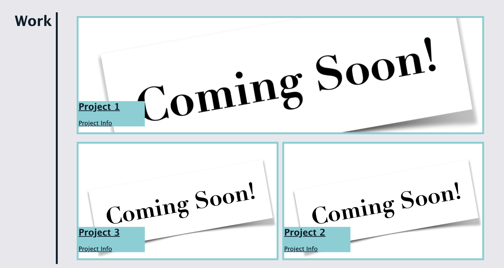
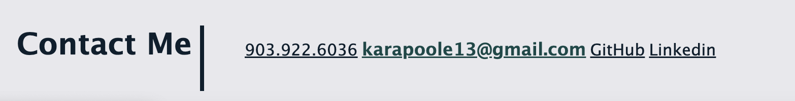
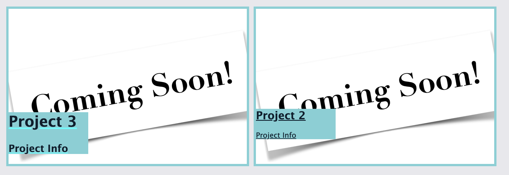
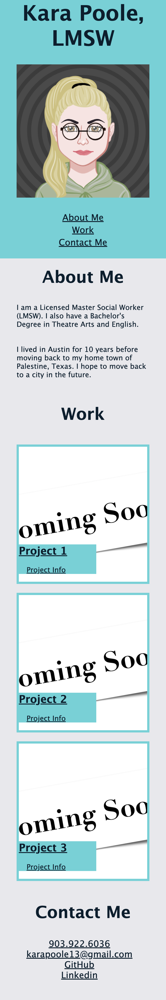
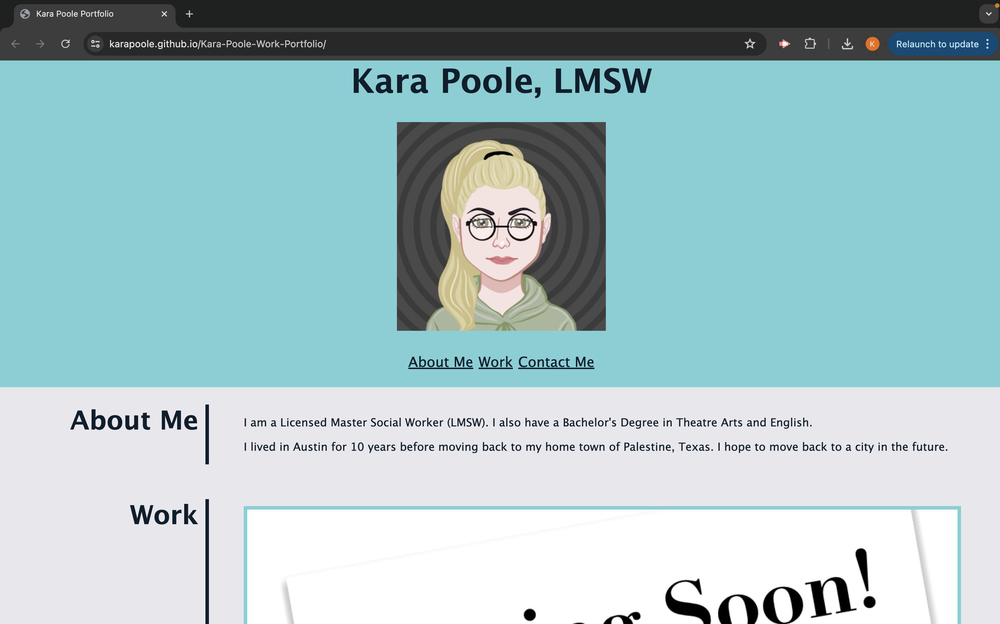

# <Kara-Poole-Project-Portfolio>

## Description

The main purpose of this project was to create a portfolio website to display personal projects and applications to future potential employers. A personal avatar was included at the top of the page. Beneath this is a navigation bar with jump links to different sections of the portfolio. This includes an “About Me” section, a collection of work, and contact information.

The work section includes clickable images that are hyperlinked to those projects. Project photos were formatted so that the first project on the webpage is the largest. Please note that at the time of the creation of this website, placeholder images were linked to placeholder “dummy” repositories in lieu of actual projects and deployed applications. Real projects and applications will be added as they are created.

External links were styled with a “hover” function so that style formatting changes in response to a cursor hover. A flexbox was utilized for the work section so that the images would be responsive to window resizing. Additionally, a media query was added so that the website would reformat to fit on smaller device screens like smartphones and tablets.

## Table of Contents

If your README is long, add a table of contents to make it easy for users to find what they need.

- [Usage](#usage)
- [Application](#application)
- [Credits](#credits)
- [License](#license)

## Usage

#### Project photos were formatted so that the first project on the webpage is the largest

#### External links were styled with a "hover" function

Font size in the navigation bar, contact links, and project cards increase on a cursor hover.

#### Media Query for formatting on smaller screens

## Application

#### Deployed Appliation URL:

https://karapoole.github.io/Kara-Poole-Work-Portfolio/

#### Screen Shot:

## Credits

edX Curriculum

## Liscense

Please refer to the liscense in the repo.
